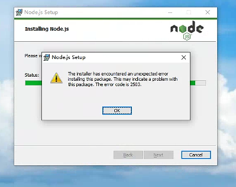

# claude code cli安装

### 使用官方脚本安装

macOS, Linux, WSL:

```
curl -fsSL https://claude.ai/install.sh | bash
```

Windows PowerShell:

```
irm https://claude.ai/install.ps1 | iex
```

Windows CMD:

```
curl -fsSL https://claude.ai/install.cmd -o install.cmd && install.cmd && del install.cmd
```

**安装完成后,验证一下:**

```
claude --version
```

如果显示版本号，说明安装成功!

### 建议：使用 npm 安装

需要先去 [nodejs.org](https://nodejs.org/) 下载安装安装 Node.js，在命令行输入：

```
node --version
```

如果显示版本号(比如 `v18.17.0`)，说明已安装。

### 安装 Claude Code

打开命令行，输入以下命令:

```
npm install -g @anthropic-ai/claude-code
```

等待安装完成(可能需要几分钟)。

**安装完成后，验证一下:**

```
claude --version
```

如果显示版本号，说明安装成功!

### 常见安装问题与解决

**问题 1:** 提示 `npm command not found`

- **原因:**你的电脑没有安装 Node.js
- **解决:**去 [nodejs.org](https://nodejs.org/) 下载安装,然后重新执行安装命令

**问题 2:** 提示 `permission denied`

- **原因:**没有管理员权限

- **解决(Mac/Linux):**在命令前加 `sudo`

  ```
  sudo npm install -g @anthropic-ai/claude-code
  ```

- **解决(Windows):**以管理员身份运行 PowerShell

**问题 3:** 安装很慢或者卡住

- **原因:**网络问题

- **解决:**使用国内镜像源

  ```
  npm install -g @anthropic-ai/claude-code --registry=https://registry.npmmirror.com
  ```

## Git下载

[Git - Install for Windows](https://git-scm.com/install/windows)

## Windows报错



#### 方法一：以管理员身份运行安装程序（最简单）

不要直接双击安装包。请按照以下步骤操作：

1. 找到你下载的 `node-vxxx.msi` 文件。
2. **右键点击**该文件。
3. 选择 **“以管理员身份运行”**。
4. 继续安装流程。这通常能直接解决 2503 错误。

#### 方法二：使用安全模式运行（如果方法一无效）

1. 按键盘上的 `Win` 键，输入 `cmd`，右键点击“命令提示符”，选择 **“以管理员身份运行”**。
2. 在黑色窗口中输入：`msiexec /package "你下载的安装包完整路径"`
   - 例如：`msiexec /package "C:\Downloads\node-v20.11.0-x64.msi"`
3. 按回车键执行，这会强制 Windows Installer 以最高权限处理安装文件。

#### 方法三：检查安装包是否损坏

如果上面的方法都失败，建议重新**从 Node.js 官网**下载安装包，确保下载文件是完整的。有时网络中断会导致安装包损坏。

#### 方法四（终极方案）：手动设置安装文件夹权限

这是解决 2503 错误最底层的办法（如果前三个都不行）：

1. **临时关闭**杀毒软件（如 360、火绒、Defender 等）。
2. 找到 `C:\Windows\Installer` 这个文件夹（此文件夹通常隐藏，需要开启显示隐藏文件）。
3. 右键点击该文件夹 -> **属性** -> **安全** -> **编辑**。
4. 选中 **Users**，在下方“Users 的权限”里，把 **“完全控制”** 勾选上（允许）。
5. 点击确定应用，然后再试着安装 Node.js。


## 如果遇到以下问题

C:\Users\yang_lab>claude Claude Code was unable to find CLAUDE_CODE_GIT_BASH_PATH path "C:\Users\yang_lab\AppData\Local\Microsoft\WindowsApps\bash.exe" C:\Users\yang_lab>claude --version 2.1.137 (Claude Code)

**方法一：命令行临时设置**

cmd

```cmd
set CLAUDE_CODE_GIT_BASH_PATH=C:\Program Files\Git\bin\bash.exe
claude
```

**方法二：永久设置（推荐）**

1. 打开「系统属性」→「环境变量」
2. 新建用户变量：
   - 变量名：`CLAUDE_CODE_GIT_BASH_PATH`
   - 变量值：`C:\Program Files\Git\bin\bash.exe`
3. 重新打开终端，运行 `claude`

