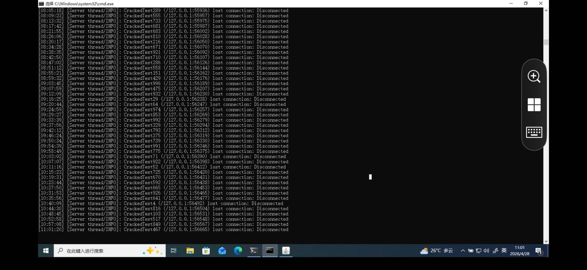
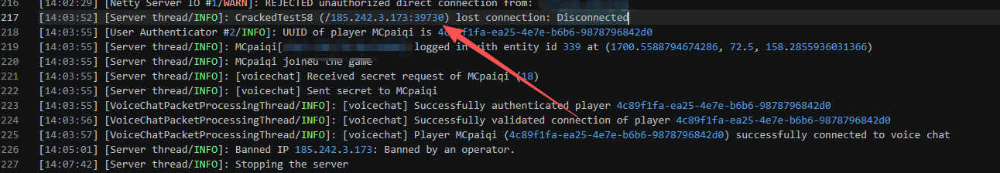

# MC内网穿透教程

下载frp工具地址：https://github.com/fatedier/frp

windows客户端

启动命令

~~~powershell
./frpc -c frpc.toml
~~~

frpc.toml填入

~~~toml
serverAddr = "xxx.xxx.xxx.xxx"
serverPort = 7000

[[proxies]]
name = "mc-tcp"
type = "tcp"
localIP = "127.0.0.1"
localPort = 25565
remotePort = 25565

[[proxies]]
name = "mc-udp"
type = "udp"
localIP = "127.0.0.1"
localPort = 24454
remotePort = 24454
~~~

linux服务端

启动命令

~~~bash
./frps -c frps.toml
~~~

~~~toml
[common]
bind_port = 7000
~~~

# ✅ 怎么让 `frps` 不受 SSH 断开影响

------

## 方案1（最推荐）：用 `systemd`（长期稳定运行）

在 Linux 上把 frp 当服务跑。

#### 1️⃣ 创建服务文件

```
sudo nano /etc/systemd/system/frps.service
```

内容：

```
[Unit]
Description=frp server
After=network.target

[Service]
Type=simple
ExecStart=/你的路径/frps -c /你的路径/frps.toml
Restart=always
RestartSec=5

[Install]
WantedBy=multi-user.target
```

------

#### 2️⃣ 启动并设置开机自启

```
sudo systemctl daemon-reexec
sudo systemctl daemon-reload
sudo systemctl start frps
sudo systemctl enable frps
```

------

#### 3️⃣ 查看状态

```
sudo systemctl status frps
```

👉 这样就算你 SSH 断了、服务器重启了，`frps` 都会自动运行。

------

## 方案2：用 `tmux` / `screen`（简单好用）

推荐 tmux

```
tmux new -s frp
./frps -c frps.toml
```

断开：

```
Ctrl + B 然后 D
```

重新连接：

```
tmux attach -t frp
```

👉 SSH 断开也不会影响进程

查看tmux进程

~~~bash
tmux ls
~~~

关闭进程

~~~bash
tmux kill-session -t 进程名
~~~

### ✔ 总结

| 操作     | 命令                       |
| -------- | -------------------------- |
| 恢复会话 | `tmux attach -t frp`       |
| 正常停止 | `Ctrl + C`                 |
| 直接杀   | `tmux kill-session -t frp` |
| 查看会话 | `tmux ls`                  |

------

## 方案3：`nohup`（最简但不优雅）

```
nohup ./frps -c frps.toml > frps.log 2>&1 &
```

👉 会在后台跑，但：

- 不方便管理
- 不会自动重启

# 如何在内网穿透的情况下看到玩家的真实ip

一般情况下，别人通过内网穿透加入服务器时，服务器日志就会显示127.0.0.1:xxxxx的玩家加入了游戏，这样无法通过ban-ip封禁玩家，也无法找到一些压力测试的来源来封禁他们，就像这样



经过接下来的测试后就可以拿到真实ip，然后在vps上ban掉这个ip



~~~bash
iptables -A INPUT -s 185.242.3.173 -j DROP
~~~

## Fabric服务端

~~~toml
serverAddr = "8.148.249.157"
serverPort = 7000

[[proxies]]
name = "mc-tcp"
type = "tcp"
localIP = "127.0.0.1"
localPort = 25565
remotePort = 25565
transport.proxyProtocolVersion = "v2"  

[[proxies]]
name = "mc-udp"
type = "udp"
localIP = "127.0.0.1"
localPort = 24454
remotePort = 24454
~~~

在frpc.toml的tcp这一行添加`transport.proxyProtocolVersion = "v2"`  ，接着在服务器mod文件夹中加入proxy-protocol-support-1.1.0-fabric.jar这个mod

下载连接[Proxy Protocol Support - Minecraft Mod](https://modrinth.com/mod/proxy-protocol-support)

启动一次后config文件夹中会出现proxy_protocol_support.json，这个文件夹存储着

##### `enableProxyProtocol`

设置为 以启用模组功能`true`

- **默认：**`true`

##### `proxyServerIPs`

一份属于你受信任代理服务器的IP地址列表。这些IP的连接**必须**发送一个代理协议头部

- **默认：**`["127.0.0.1"]`

##### `directAccessIPs`

允许直接连接**且无需**代理协议头的IP或CIDR范围列表。这对管理员、本地网络玩家和服务器端工具来说非常理想

- **默认：**`["127.0.0.1", "192.168.0.0/16"]`

##### `whitelistTCPShieldServers`

当 时，模组会自动获取 TCPShield 的官方代理 IP，并将其添加到可信列表`true` `proxyServerIPs`

- **默认：**`false`

如果开启mod后像通过局域网连接，则需要在directAccessIPs加上你的局域网ip，例如

~~~json
{
  "enableProxyProtocol": true,
  "proxyServerIPs": [
    "127.0.0.1"
  ],
  "directAccessIPs": [
    "127.0.0.1",
    "172.16.229.148",
    "172.16.0.0/12",
    "192.168.0.0/16"
  ],
  "whitelistTCPShieldServers": false
}
~~~

