最近这几个月几乎每天都在陪伴我的工具，就是 Codex 了。

但是，很多小白之所以被卡住，往往是因为一开始看到界面时，觉得内容有点多、有点杂，一时有些发懵，不知道该怎么下手。

所以我突然想到，如果我能够把界面**进行一次详细的图文拆解**，讲得更细致一些，那么对于小白用户来说，就不会再感到害怕了，这也能够迅速帮助小白快速理解并掌握 Codex 这样一个强大的工具。

那话不多说我们马上开始！

# Codex 从 0 到 1 保姆级教程

## 一、安装登录

### 1.安装

官网安装地址：

https://chatgpt.com/zh-Hans-CN/codex/

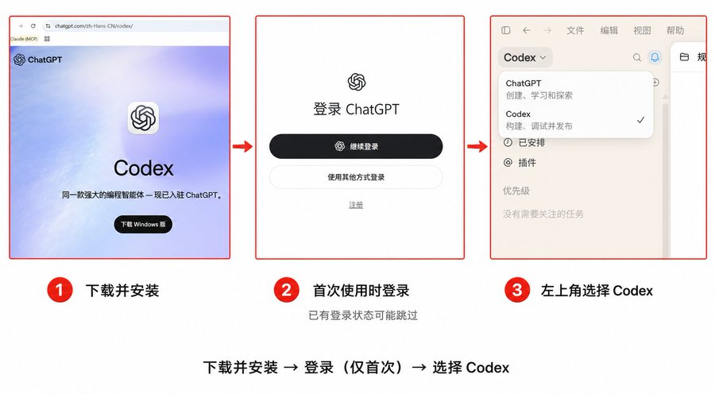

如果是windows用户，可以直接在微软商店搜索codex或者ChatGPT来下载

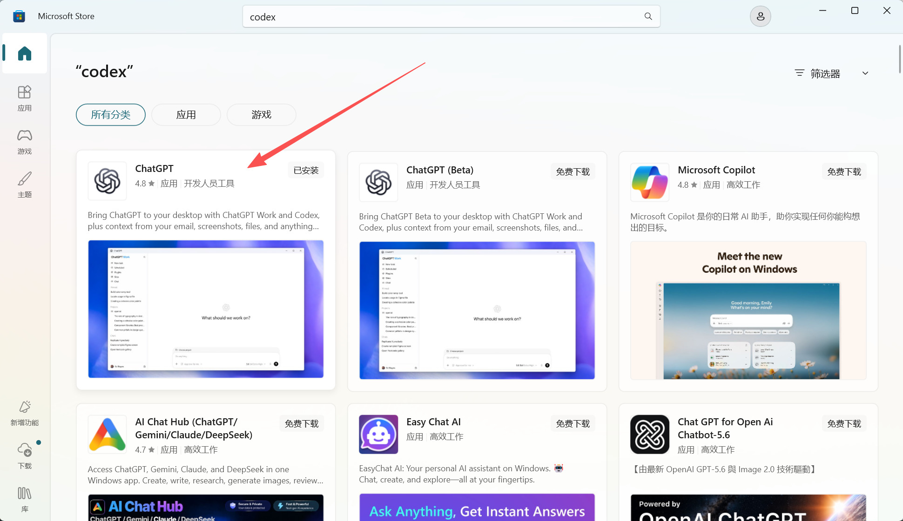

下载是非常简单的，只要在对应的网址选择下载按钮，像平时安装桌面 APP 一样就可以了。

### 2.登录

登录的时候，大家可以登录自己相应的 ChatGPT 账号，没有网络环境的话可以选择用中转站或者是其他国产模型的api进行登录，我推荐使用cc-switch这个工具来切换api，点击GPT的图标之后点右上角添加供应商，选择已有模板或者是填入中转站的baseurl、api-key和模型名称，再点击添加，启用

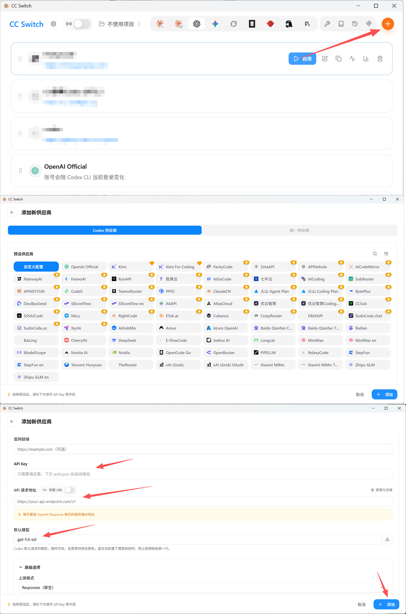

第一次登录后，不需要先改十几项设置。点一次“新对话”，发一个很小的请求，确认你能收到结果就行：

~~~text
我刚开始使用 Codex。
请先告诉我当前任务能看到哪些文件夹。
只读检查，不要创建、修改或删除任何文件
~~~

如果这条能正常返回，你已经完成第一次启动。

## 二、第一次打开先看全局

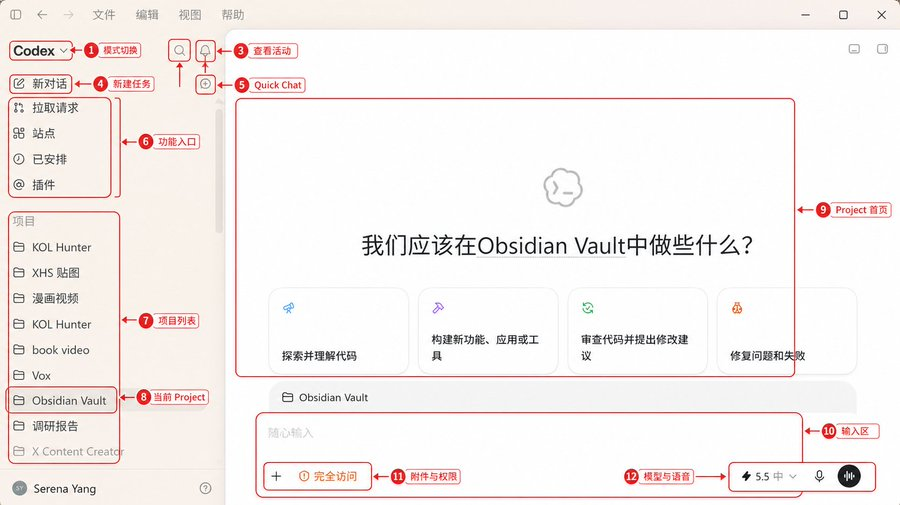

打开 ChatGPT 桌面端以后，在左上角的体验选择器里进入 Codex。左侧是功能入口和 Project，中间会显示当前 Project 或任务，底部是输入框。

第一次只需要记住这几个位置：

| 位置               | 现在先记住什么                           |
| ------------------ | ---------------------------------------- |
| 新对话             | 新开一个 Codex 任务                      |
| 新对话右侧的小图标 | 入口可见时，可打开 Quick Chat 问普通问题 |
| 搜索               | 找回以前的任务，不用一直翻最近列表       |
| 拉取请求           | 查看与代码仓库相关的 Pull Request        |
| 项目               | 把相关任务、资料和本地文件夹放在一起     |
| 插件               | 给 Codex 接上浏览器、GitHub、云盘等能力  |
| 站点               | 管理已经通过 Sites 保存或部署的网站      |
| 已安排             | 管理定时任务和它们的运行结果             |
| 输入框             | 发 Prompt、图片和文件，选择权限与模型    |

## 三、Quick Chat、Project、Codex，到底怎么选

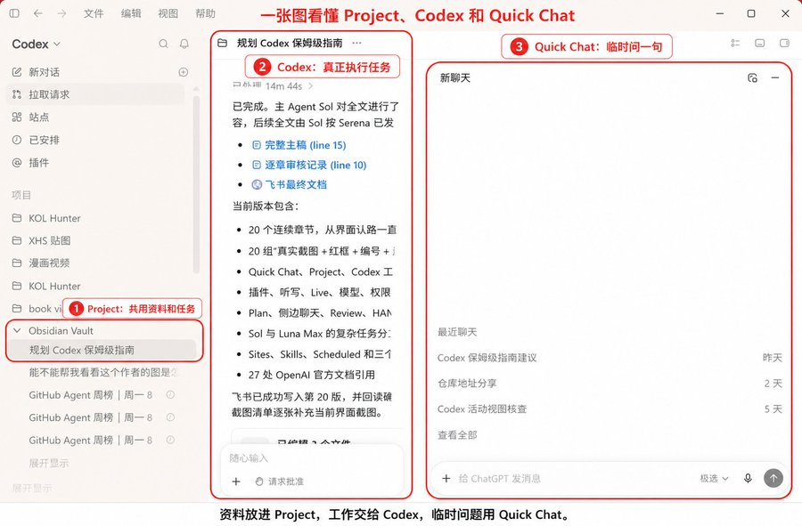

很多人现在最容易绕进去的问题是：ChatGPT 和 Codex 有什么区别？

在桌面端里一直讨论这个，意义已经不大了。真正需要做的是：你手上的这件事，应该从哪个入口开始。

我会这样分：

**1️⃣** **只是问一句，用 Quick Chat。**

比如解释一个词、改一段文案、帮你构思标题。鼠标移到“新对话”上，如果右侧能看到 Quick Chat 图标，点它就能开一个普通 ChatGPT 对话。

Quick Chat 不会出现在 Codex 左侧的最近任务里。以后找不到，不是丢了，只是它属于普通 ChatGPT 对话。

**2️⃣** **多条对话要共用资料，用 Project。**

比如你在做 X 内容创作。选题、长文、配图、数据复盘是不同任务，但都会用到同一批 Obsidian 素材、写作规则和已发布样本。这时应该建一个 Project，而不是每次重新上传资料。

**3️⃣** **需要动文件、跑命令、看变更，用 Codex。**

整理文件夹、修改网页、清洗表格、生成 Markdown、运行测试，这些任务放在 Codex 里。它能在你授权的项目范围内读写文件，也会显示执行过程和结果。

**这三者可以连起来用，不需要三选一。**

OpenAI 当前对 Project 的建议也很直接：工作会持续、会产生多个结果，或者多个任务要复用同一批文件和来源时，就建 Project；只有一个自包含问题时，可以直接开对话。

## 四、插件先装，但不要一口气全装

建好 Project 以后，我会先去看一眼插件。

因为很多任务卡住，不是 Codex 不会做，是它根本没有资料入口。你让它整理 Gmail，它没连邮箱；让它看已登录的网页，它没有 Chrome；让它处理 GitHub Issue，它也没有对应连接。

插件可以解决这些问题。

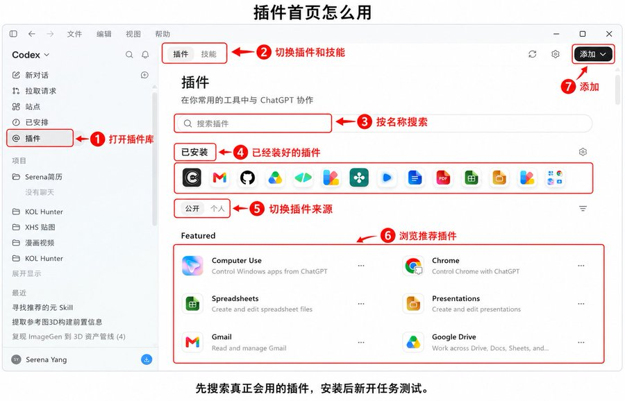

这里也强调了这一点。但“插件就是给 Codex 装工具”只说对了一半。现在的插件是一个能力包，里面可能同时带 Skills、连接器、MCP、Hooks、浏览器能力和定时任务模板。

安装步骤：

1. 打开左侧“插件”。
2. 搜索你确实要用的插件。
3. 点进详情，按 + 安装。
4. 如果它要连接外部服务，按提示完成登录和授权。
5. 安装后新建一条任务，再让 Codex 使用它。

第一批装什么，不用抄一张“必装榜”。看你要做什么：

- 经常处理邮件和云盘资料，装对应的 Gmail、Google Drive 等连接器。
- 管代码仓库，装 GitHub。
- 要检查网页，先装 Browser；需要使用自己已经登录的 Chrome 页面，再考虑 Chrome。
- 必须点桌面软件，才装 Computer Use。
- 经常做表格、PDF、PPT，装对应的文件能力。

插件装完不代表权限全开。

外部服务仍然受那个账号本身的权限控制，Codex 在本地执行时也会继续受权限模式和沙箱限制。一个 Gmail 插件不会因为装进来，就自动替你发送邮件。

我更建议新手先装 1 到 2 个，跑一次真实任务。装十几个又不用，只会让你更难判断 Codex 到底调用了什么。

## **五、真正开始前，把输入框看明白**

很多人打开 Codex，只盯着中间那块输入框。

其实你写 Prompt、给资料、选权限、选模型，都在这里发生。

这一部分不用背。我们就拿一个任务走一遍：把 Project 里的素材整理成一篇文章。

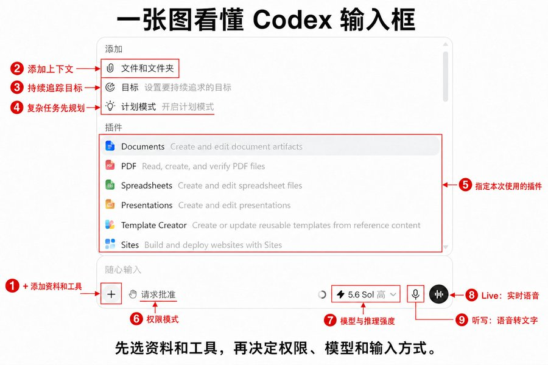

**1-需求不明确的时候，可以跟 ChatGPT Live 聊聊**

如果你脑子里只有一句“我想写一篇 Codex 教程”，但还说不清读者、结构和最终形式，可以从一个新的空对话或任务进入 ChatGPT Live。

Live 是实时语音对话。你可以边说边补充，也可以打断它，让它反问你。比较适合讨论需求、梳理想法、确认到底要做什么。

要注意：一条任务需要从语音模式开始，才能作为 Live 对话使用。已经用文字开始的任务，通常提供的是听写，不会直接变成同一条 Live 对话。Voice 的可用性还会受套餐、地区和工作区设置影响。

你可以直接说：

我想写一篇给 Codex 小白看的长文，但现在结构还很乱。 你先别写文章，先连续问我几个问题，把目标读者、读完能学会什么、必须包含的功能和最终发布形式聊清楚。

**2-需求已经想清楚，用听写把 Prompt 说出来**

听写和 Live 是两件事。

听写只是把你说的话变成输入框里的文字。说完以后，你还能删改，再决定要不要发送。

这很适合写长 Prompt。尤其是你脑子里信息很多，打字反而会漏。

当前桌面端可以从输入框里的麦克风开始，也可以在键盘快捷键设置里查看或修改听写快捷键。飞书里记录的“设置 → 常规 → 听写”还包括保持听写栏可见、听写词典等选项，但具体分组会随版本变化，按你当前设置页搜索“听写”最稳。

专有名词经常识别错，可以加进听写词典，比如 Serena、Obsidian、AGENTS.md、Luna Max。

## 六、权限和模型怎么选？

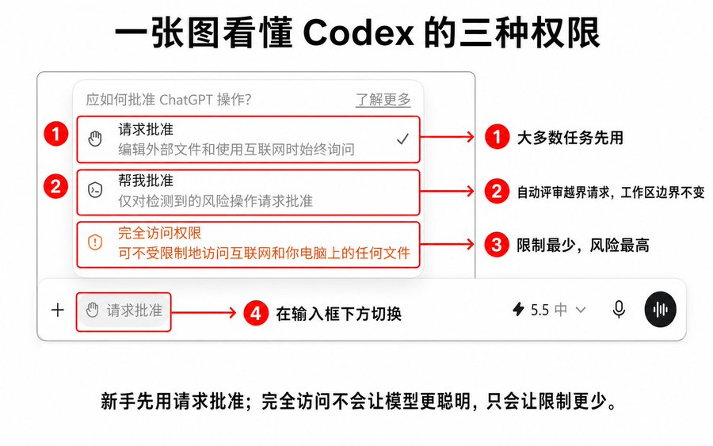

我自己的原则很简单：新手先用“请求批准（Ask for approval）”。

它允许 Codex 在当前工作区内完成常规读写，超出边界时会停下来申请。它并不是每一步都问你，所以也没有想象中那么烦。

“帮我批准（Approve for me）”会把越界请求交给自动评审，但它不会扩大原来的工作区边界。适合你已经看懂任务流程，又不想频繁处理低风险申请的时候。

“完全访问权限（Full access）”会拿掉本地沙箱限制。Codex 可以更连续地改文件、运行命令和访问网络，但风险也更高。

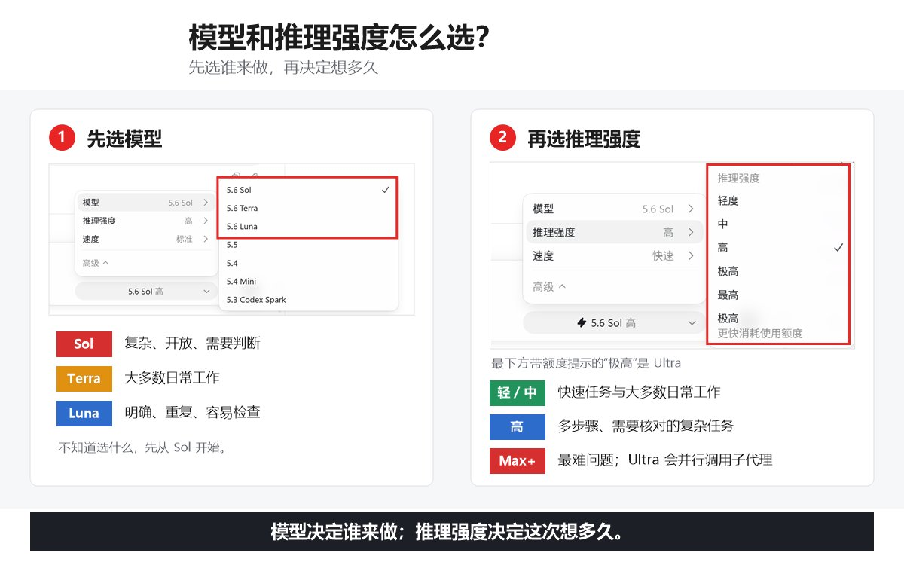

模型和推理强度，先按任务难度选

当前 Codex 主要把 GPT-5.6 模型分成 Sol、Terra 和 Luna：

- Sol 适合目标还不够清楚、需要判断、研究和润色的任务。
- Terra 适合大多数日常工作。
- Luna 适合要求明确、步骤稳定、结果容易检查的重复任务。

不知道选什么，先用默认 Power，也就是当前的 Sol + Medium。不要一上来就把所有任务开到 Max。

推理强度可以这样选：

| 任务                                 | 建议起点          |
| ------------------------------------ | ----------------- |
| 改标题、改颜色、提取字段             | Light             |
| 写文章、做页面、整理资料             | Medium            |
| 多文件修改、排查问题、比较多种方案   | High / Extra High |
| 单个很难的问题，愿意用更多时间换深度 | Max               |
| 能拆成多个独立部分并行完成           | Ultra             |

## 七、先建一个 Project，把文件范围圈出来

Codex 真正开始好用，是从它能读到你的资料开始。

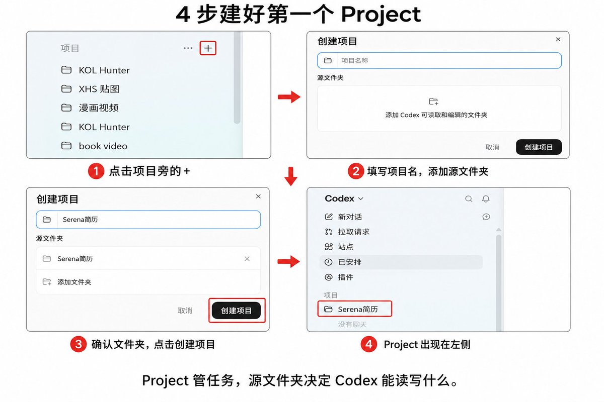

新手很容易为了方便，直接把整个桌面、整个 OneDrive，甚至装着账号和密钥的目录都加进去。先问自己一句：我到底准备让 Codex 在哪些地方工作？确定以后，只添加这些文件夹。

建 Project 的步骤很简单：

1. 点击左侧“项目”旁边的 +。
2. 给项目起一个能看懂的名字，比如“X 内容创作”“客户资料整理”。
3. 添加 Codex 需要读取和编辑的本地文件夹。
4. 如果加了多个文件夹，确认哪个是主文件夹。
5. 创建后，把左侧“最近”里的相关任务拖进来，或者直接在项目里新开任务。

主文件夹很重要。

新的 Codex 任务会默认从这里开始工作，AGENTS.md、项目 Skills 和 .codex/config.toml 也会从主目录自动发现。其他已添加的文件夹仍然可以搜索、读取和编辑，但它们不负责项目规则的自动发现。

第一次建 Project，建议只加一个文件夹。先确认范围正确，再考虑第二个。

不要加入这些东西：

- 钱包密钥和助记词
- 密码导出文件
- 整块私人云盘
- 与当前任务无关的客户资料

建好以后，可以先发一条只读 Prompt：

```text
请先读取当前 Project 的主文件夹。

告诉我：
1. 这个文件夹里主要有什么
2. 哪些文件和当前任务有关
3. 你准备从哪里开始

先不要改文件。范围不清楚的地方先问我。
```

看到它列出的目录和你预期一致，再让它开始动手。

## 八、任务开始变多以后，先学会找和收

Codex 用几天后，左侧“最近”很快就会挤满。 

这时候不要继续靠滚轮找，也别看到旧任务就删除。

我会先做三件小事：改名、置顶、归档。

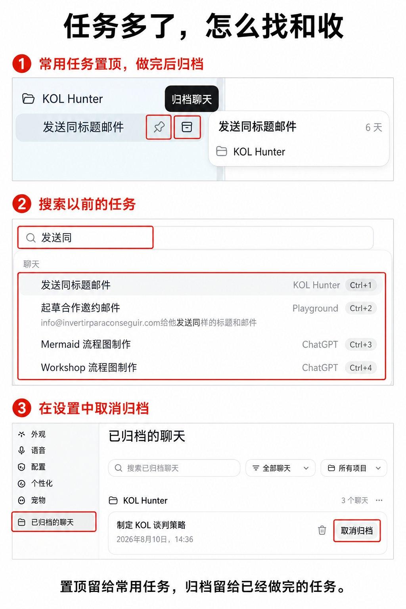

任务名最好写结果，不要叫“新对话 1”“帮我看一下”。比如：

- Codex 保姆级指南初稿
- 客户名单去重与优先级
- 网站移动端溢出修复

经常回去看的任务可以置顶。置顶只是把它放在前面，不会给任务增加上下文，也不会让 Codex 记得更多。

做完的任务直接归档：鼠标移到任务上，点击右侧的归档图标。它会从最近列表消失，但内容还在。需要恢复时，进入设置里的“已归档的聊天”，找到对应任务后点击“取消归档”。

找任务有两种搜索：

- 搜索以前的任务：用左侧搜索，或 Ctrl+G。
- 在当前任务里找一句话：用 Ctrl+F。

一个搜全部任务，一个只搜当前对话。很容易按错。

## 九、怎样写好 Prompt 

普通任务先写四件事：

1. 你最后要什么。
2. 它应该看哪些资料。
3. 哪些东西不能碰。
4. 做到什么程度才算完成。

比如“帮我写一篇文章”很容易飘。可以改成：

```text
目标：
根据当前 Project 里的 Codex 素材，写一篇给第一次使用 Codex 的读者看的 X 长文。

资料：
先读取“参考博主界面拆解”和“飞书 Codex 学习库”。

边界：
不要编造按钮和功能；易变化的信息以 OpenAI Docs 为准；不要自动发布；不要修改原始素材。

完成标准：
读者看完能找到主要入口，能建立 Project，能写出第一条任务，知道怎样检查结果。正文保存为 Markdown，并列出还需要补拍的截图。
```

如果你有参考图、参考文章或想要的输出格式，再补上 Reference 和 Output。

复杂任务还要多写两项：步骤和检查点。

比如先让它做结构，你看过以后再写正文；正文写完先审事实，再同步飞书。这样中间任何一步不对，都不用整篇返工。

## 十、怎样找到 Luna Max

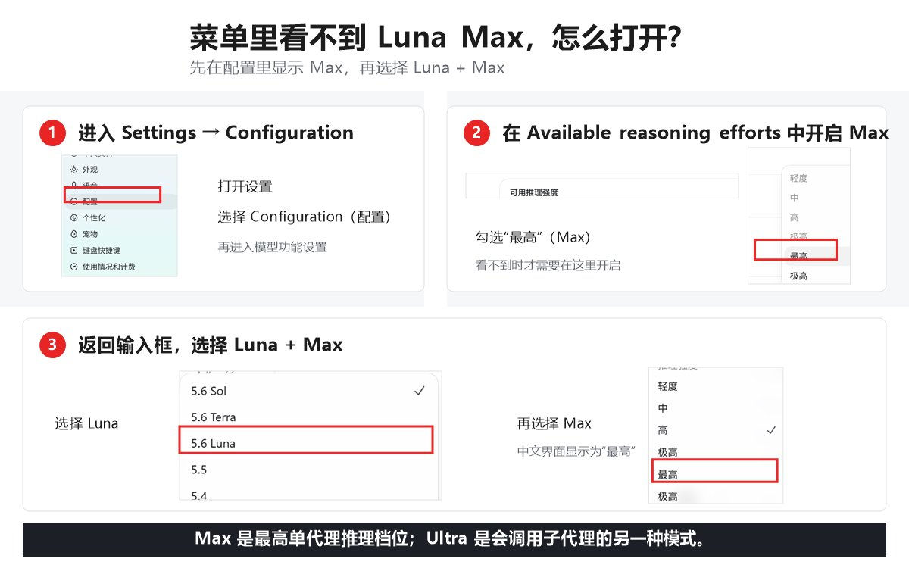

如果你准备使用 Luna Max，但模型菜单里看不到 Max，可以这样开启：

1. 进入 Settings → Configuration。
2. 打开 Available reasoning efforts，勾选“最高（Max）”。
3. 回到输入框，先选择 Luna，再把推理强度切到 Max。

不同账号、工作区策略和发布版本显示的选项可能不同。官方确认的口径是：如果菜单里看不到 Max，需要先在应用设置中启用；不宜写成所有用户都一定默认关闭。

## 十一、设置里最值得先改的几项

设置页很长，我不建议新手挨个研究。

先看这几项就够了。

### Personalization：把长期偏好写进去

自定义指令适合放跨项目都稳定的工作习惯。

比如：

```markdown
# 工作原则

## 1. 先想清楚
- 在改代码或做出不可逆操作前，说明关键假设。
- 需求有歧义时，优先采用最简单、可撤销的理解，并说明它；只有错误代价高时才先提问。
- 不臆造需求；无关内容不处理。
- 只有确实存在重要取舍时，简要说明选择和原因。

## 2. 简单优先
- 用能完整解决问题的最小方案。
- 不做推测性功能、过度抽象或无关重构。
- 优先修改现有代码；只有必要时才新增文件或依赖。
- 变更开始膨胀时，主动收缩为更少文件、更少层次的方案。

## 3. 克制执行并验证
- 只改完成任务所需的文件。
- 不改无关代码，不提交代码，除非我明确要求。
- 完成前检查结果是否满足任务目标。
- 改动后运行最小相关检查或测试；如无法运行，说明原因和未验证的部分。
```

这段指令能减少重复沟通，也能少一点返工。至于会不会省 Token，要看任务本身，别把它当成保证。

桌面端里，自定义指令会更新个人层的 AGENTS 指令。它适合放“我一直都这样工作”。

### AGENTS.md：这个项目自己的规矩

Project 建好后，再在主文件夹放一份 AGENTS.md。

它不是神秘配置，就是一份给 Codex 看的项目说明：这个文件夹做什么、重要资料在哪里、哪些东西不能动、结果保存到哪、完成后怎么检查。

比如内容项目可以写：

```markdown
# 项目说明

这个项目用于内容创作。

# 写作要求
- 写作前先读取指定素材和已发布样本。
- 不编造数据、来源和使用体验。
- 保留自然口语感，少用报告腔和整齐排比。

# 文件规则
- 原始素材只读，不覆盖。
- 草稿保存到“过程稿”。
- 未经确认，不移动文件，不自动发布。

# 完成标准
- 正文、来源、截图清单齐全。
- 写完后检查事实、链接和 AI 味。
```

个人自定义指令、Project instructions 和 AGENTS.md 很容易混：

- 每个项目都要遵守的个人习惯，放自定义指令。
- 同一 ChatGPT Project 里的资料说明，可以放 Project instructions。
- 本地文件夹、代码库和团队工作规则，放 AGENTS.md。

Codex 会从全局目录一路读到当前工作目录，越靠近当前文件夹的指令越具体。

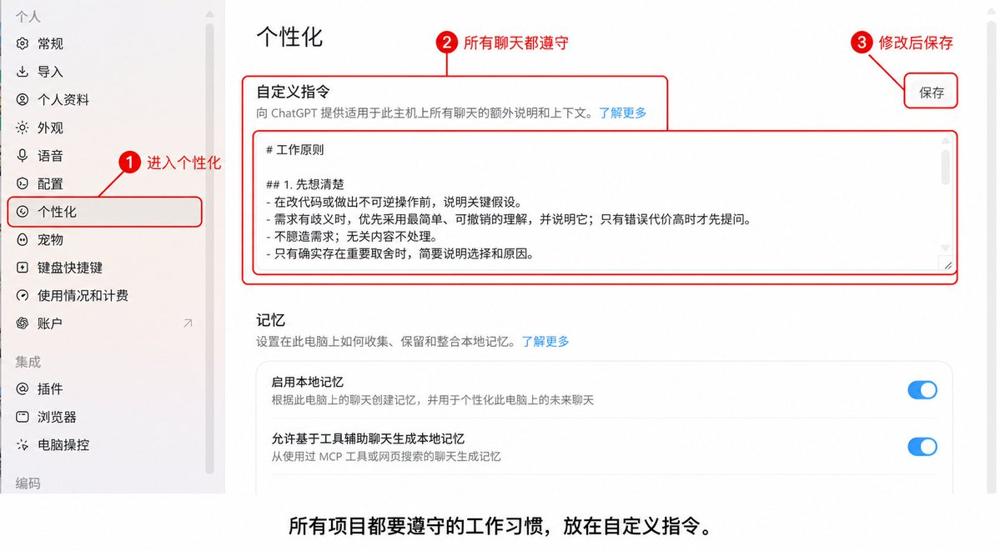

## 十二、第一次真正跑任务，先 Plan，再执行

现在 Project、资料、插件、Prompt、权限和模型都准备好了。

终于可以让它干活。

小任务不用 Plan。改一个标题、整理五条笔记，直接发就行。

任务有这些情况时，我会先开 Plan：

- 目标还有点模糊
- 会改很多文件
- 中间有重要取舍
- 做错以后返工成本高

比如这篇保姆级指南，不应该上来就让 Codex 一次写完。先让它读 Obsidian 博主素材、飞书文档和 Serena 已发布长文，再给结构和截图清单。结构过了，才写正文。

可以直接发：

```text
请先进入 Plan，不要写正文，也不要修改文件。

目标：完成一篇 Codex 从 0 到 1 保姆级指南。

先做三件事：
1. 读取指定参考资料，列出可以确认的功能和仍需核对的事实
2. 按小白真实使用顺序设计文章主线
3. 列出每一节需要的截图，以及截图里要圈出的按钮

我确认结构以后，再进入写作。
```

Plan 的价值不是多生成一份漂亮大纲。

是让你在 Codex 动文件、花时间跑任务之前，先看它理解得对不对。

如果任务会跑很久，还可以定义 Goal：最终交付什么、哪些证据能证明完成、哪些情况应该停下来找你。桌面端会显示 Goal 进度，运行中可以暂停、修改或继续。

一个可验收的 Goal 可以这样写：

```text
目标：完成 Codex 保姆级指南，并同步到飞书草稿。

完成证据：
- 正文覆盖约定的全部功能
- 所有易变化功能已对照 OpenAI Docs
- 每个操作章节都有截图规划
- 本地 Markdown 与飞书内容一致

停止条件：
- 缺少关键截图时先列清单，不编造界面
- 飞书权限不足时停止写入，并给出明确的授权入口
```

## 十三、对话越来越长，什么时候继续，什么时候换

用 Codex 做长任务，右下角的上下文百分比会慢慢升高。

它可以理解成这条任务的临时工作台。你的文字、文件、图片、Codex 的回复和工具结果都在占位置。

到 100% 不会突然把任务删掉。Codex 会自动压缩前面的内容，也可以手动使用 compact。问题是，压缩保留的是摘要，一些早期小要求可能被省掉。

不要看到 80% 就立刻换任务。

只要还是同一件事，Codex 也没有忘记要求，就继续做。改同一个网站、修同一个问题、补同一篇文章，都算同一件事。

出现下面这些信号，再考虑换：

- 已经开始做另一件事
- 它反复忘记同一条要求
- 做完的内容又被重做
- 文件和决定太多，前后开始打架

换任务有三种做法。

**第一种，继续旧任务。**

最省事。任务还清楚就别折腾。

**第二种，新任务里引用最近对话。**

在输入框输入 @，入口可用时选择最近任务，再告诉它从哪一步继续。适合只想换一个干净窗口的短衔接。

它是引用，不是把旧对话原封不动搬过来。旧任务已经压缩掉的细节，不会自动长回来。

**第三种，写 `HANDOFF.md`。**

跨了很多天、改过很多文件，或者旧任务已经明显混乱时，让 Codex 在项目里写一份交接单：

```text
请把当前任务整理成 HANDOFF.md，保存到项目主文件夹。

写清楚：
1. 任务目标
2. 已完成内容
3. 修改过的文件
4. 已确认的决定和不能改变的约束
5. 未完成内容
6. 当前问题
7. 下一步

只记录当前真实状态，不要重新执行任务。
```

然后新开任务，继续使用同一个 Project：

```text
先读取 HANDOFF.md。
用几句话告诉我上一个任务做到哪里，然后只从“下一步”继续，不要重新开始。
```

HANDOFF.md 不是必须使用的官方功能名。它只是一个很实用的工作方法：把“现在的真相”存进项目文件，不再赌旧对话还能记住多少。

## 十四、同时跑好几个任务，去“查看活动”排队

当你只开一条任务时，左侧最近列表够用。

同时跑三四条以后，情况会变：有的正在执行，有的等你批准，有的已经完成，还有一条卡在问题上。

这时点右上角的“查看活动”或铃铛入口。

当前桌面端会把需要你关注的任务集中到“优先级”区域。你不用一个窗口一个窗口点开检查。

我一般先处理两类：

1. 正在等人工确认的任务。不处理，它就不会往下走。
2. 已经报错或需要补充信息的任务。先判断值不值得继续。

正常运行中的任务，不用因为它十秒没有新文字就频繁打断。

任务多的时候，标题也要改清楚。“新对话 4”放进优先级列表还是看不懂；“网站移动端验收”“文章事实 Review”一眼就知道该先处理谁。

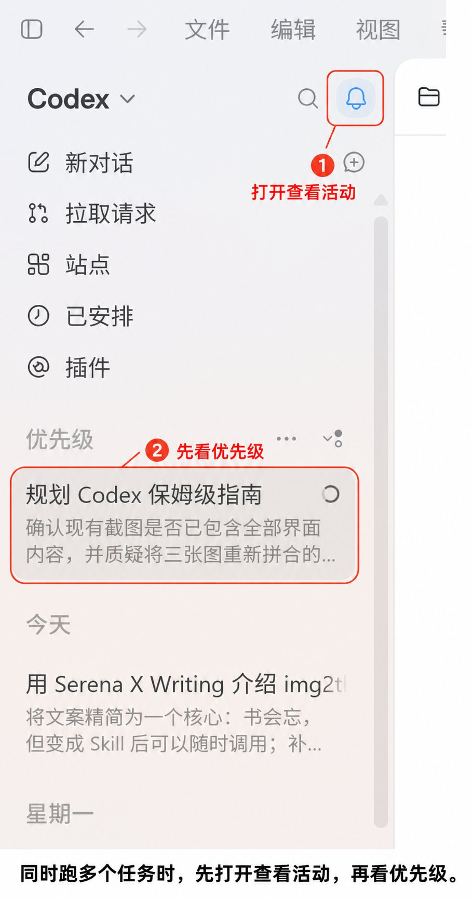

## 十五、复杂任务怎么跑：Sol 负责想清楚，Luna Max 负责执行

有些任务不是写一条超长 Prompt 就能解决。

比如做一份跨多个来源的研究、重构一个项目、整理一整套知识库。里面既有需要判断的部分，也有大量重复执行。

我现在会把它拆成四段：

1. 先定义 Goal，把模糊想法变成可验收结果。
2. 用 Sol 做研究和计划，找出风险、依赖和执行顺序。
3. 计划确认后，把步骤明确、结果可检查的部分交给 Luna Max。
4. 全部跑完，再让 Sol 做一次 Review。

这套分工是实用工作流，不是 OpenAI 规定的官方编排。

为什么不从头到尾都用 Luna Max？

因为 Luna 更适合清楚、可重复的任务。前面还在决定“到底该做什么”时，Sol 的判断和润色更合适。等任务已经被拆成清单，Luna Max 才真正像一个耐跑的执行者。

可以这样发给 Sol：

```text
先不要执行。

请把这个复杂任务压成一个可验收的 Goal，并完成研究和计划。
计划里写清：输入、步骤、每一步输出、需要人工确认的检查点、完成标准和停止条件。

最后单独列出：哪些步骤已经足够明确，可以交给 Luna Max 执行。
```

交给 Luna Max 时，不要只丢一句“按计划做”。把已经批准的计划、文件范围和完成标准一起带过去：

```text
请按已批准的计划执行第 2 到第 5 步。

不要重新设计方案。
每完成一步，记录修改文件和验证结果。
遇到计划外问题先停下来，不要自行扩大范围。
```

最后回到 Sol：

```text
请作为主审阅 Agent 检查最终结果。
对照原 Goal 和完成证据，先列出不合格项，再决定是否需要返工。
```

⚠️⚠️文中的界面名称按 2026 年 8 月的 ChatGPT 桌面端整理。入口可能随版本更新，模型、权限和功能是否可用也会受套餐、地区和工作区设置影响。遇到不一致时，以 OpenAI 官方和和你当前看到的界面为准。