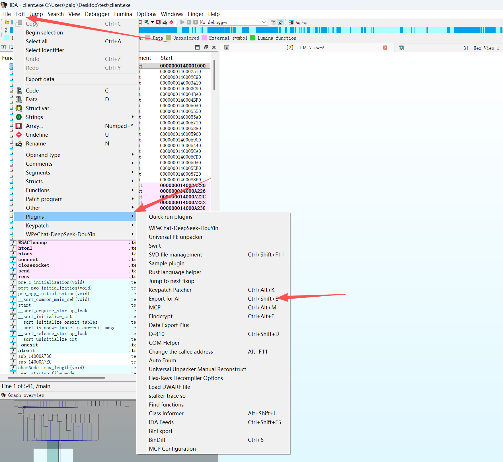
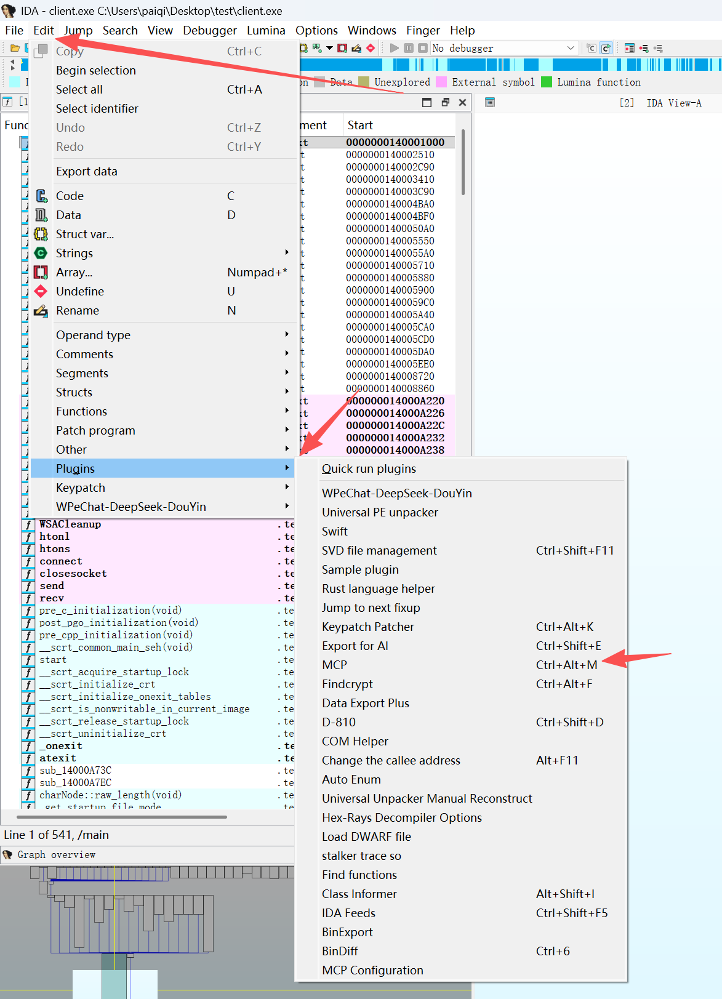
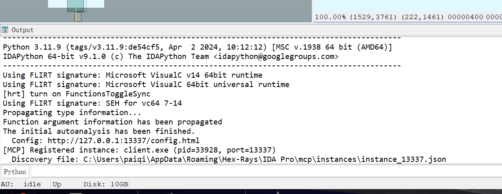

# pwn方向使用AI解题教程

## 将IDA的反编译信息导出给agent

### 方案一：使用ida-no-mcp

首先需要给IDA装上插件ida no mcp

https://github.com/P4nda0s/IDA-NO-MCP

下载该链接中的INP.py

将 `INP.py` 复制到 IDA 插件目录：

- Windows: `%APPDATA%\Hex-Rays\IDA Pro\plugins\`
- Linux/macOS: `~/.idapro/plugins/`

重启 IDA 后：

- 快捷键: `Ctrl-Shift-E` 快速导出
- 菜单: `Edit` -> `Plugins` -> `Export for AI`



导出后有个名叫export-for-ai的文件夹

解题时向AI发送（推荐在linux使用vscode中的codex插件，并开启plan mode计划模式）：

~~~
这是一道ctf-pwn题目，附件是xxx，libc是xxx，export-for-ai是elf文件用ida-no-mcp导出的文件信息，远程靶机是x.x.x.x:xxxx，请你帮我拿到靶机上的flag
~~~

#### 导出内容

| 文件/目录             | 内容           | 说明                                                         |
| --------------------- | -------------- | ------------------------------------------------------------ |
| decompile/            | 反编译 C 代码  | 每个函数一个.c 文件，包含函数名、地址、调用者(callers)、被调用者(callees) |
| decompile_failed.txt  | 反编译失败列表 | 记录无法反编译的函数及失败原因                               |
| decompile_skipped.txt | 跳过函数列表   | 记录被跳过的库函数和无效函数                                 |
| strings.txt           | 字符串表       | 包含地址、长度、类型(ASCII/UTF-16/UTF-32)、内容              |
| imports.txt           | 导入表         | 格式:地址:函数名                                             |
| exports.txt           | 导出表         | 格式:地址:函数名                                             |
| memory/               | 内存 hexdump   | 按 1MB 分片，hexdump 格式，包含地址、十六进制、ASCII         |

#### 功能特性

#### 反编译函数导出

每个函数导出为独立的 `.c` 文件，文件头包含元数据：

/* * func-name: sub_401000 * func-address: 0x401000 * callers: 0x402000, 0x403000 * callees: 0x404000, 0x405000 */// 反编译代码...

智能处理：

- 自动跳过库函数和无效函数
- 处理特殊字符和重名函数（添加地址后缀）
- 生成详细的失败和跳过日志
- 显示导出进度（每 100 个函数）

##### 调用关系分析

- Callers: 哪些函数调用了当前函数
- Callees: 当前函数调用了哪些函数
- 帮助 AI 理解函数间的依赖关系和调用链

##### 内存导出

- 按段(segment)导出所有内存数据
- 每个文件最大 1MB，自动分片
- Hexdump 格式，包含地址、十六进制字节、ASCII 显示
- 文件名格式: `起始地址--结束地址.txt`

##### 统计信息

导出完成后显示详细统计：

- 总函数数量
- 成功导出数量
- 跳过数量（库函数/无效函数）
- 失败数量（含失败原因）
- 内存导出大小和文件数

### 方案二：使用ida-pro-mcp

**IDA Pro MCP** 是一个专为逆向工程和二进制分析设计的工具，旨在通过 **Model Context Protocol (MCP)** 提供与 **IDA Pro** 的交互能力。它允许用户通过自动化方式访问和操作 IDA 数据库，并结合大语言模型（LLM）实现更高效的分析。

#### 核心功能

IDA Pro MCP 提供了一系列强大的功能，支持从 IDA 数据库中提取信息并进行操作，包括：

**函数操作**：通过名称或地址获取函数的反汇编代码、反编译代码，重命名函数或变量，设置函数原型等。

**数据提取**：获取指定地址的字节数据、字符串列表、导入/导出表、交叉引用等。

**交互式分析**：支持实时交互，用户可以通过 MCP 工具动态分析二进制文件。

**高级功能**：如设置全局变量类型、声明 C 类型、搜索字符串模式等。

安装与配置

安装 IDA Pro MCP 非常简单，可以通过以下步骤完成：

使用 pip 安装或升级 MCP 包：

~~~bash
pip install --upgrade git+https://github.com/mrexodia/ida-pro-mcp
~~~

配置 MCP 服务器并安装 IDA 插件：

~~~bash
ida-pro-mcp --install
~~~

确保重启 IDA Pro 或相关工具以使配置生效。

开启mcp





下面就会显示地址和端口，把这些发给AI，让它连上后写exp就行

### Tips

在 IDB 目录下可以同时添加更多上下文，让 AI 获得完整视角：

| 目录   | 内容                                 |
| ------ | ------------------------------------ |
| apk/   | APK 反编译目录（APKLab 一键导出）    |
| docs/  | 逆向分析报告、笔记                   |
| codes/ | exp、Frida scripts、decryptor 等脚本 |

最先进的 AI 模型能够利用所有信息与脚本，为你提供最强力的逆向工程辅助。

## EXP攥写规范

[EXP攥写规范.md](https://gdufs-gwhtsec.feishu.cn/wiki/NomVwRYUXiPda3kf5qacmVzEn4d)下载后告诉agent要按照这个md文档规范写exp

撰写EXP.py时需要遵循本EXP撰写规范

### 0.EXP目标确认

```Plain
EXP必须满足至少一个：

1. 获取 shell（进入 interactive 且无异常）
2. 打印 flag
3. 程序稳定运行至交互状态

否则视为 EXP失败
```

### 1.EXP结构模板

```Python
from pwn import*

context(os='linux', arch='{amd64/i386}', log_level='debug')

elf = ELF({elfname})
libc = ELF({libcname})
p = process(elf.path)

#这些是具体内容
#这些是具体内容
#这些是具体内容

p.interactive()
```

### 2.exp交互规范

```Python
#发送信息请打包为payload后发送

#示例一：发送比特流
payload=b'a'*0x10+p64(0)+p64(0x20)
p.sendline(payload)

#示例二：发送字符串
payload=str(114514)
p.sendlineafter(b'hello',payload)
```

### 3.函数编写规范

```Python
#菜单性函数定义需要遵循以下模板，不得过多冗余

#示例：
def add_msg(slen,payload):
  p.sendlineafter(">> ",str(1))
  p.sendlineafter("send: ",str(slen))
  p.sendlineafter("> ",payload)


#功能性函数需要尽可能的简洁和强可读性

#示例1：

def tea_decrypt_bytes(data: bytes) -> bytes:
    res = bytearray()
    delta = 1640465991
    const_val = 1131796
    init_v4 = (0 - 17 * delta) & 0xFFFFFFFF
    for i in range(0, len(data), 8):
        v2, v3 = struct.unpack('<II', data[i:i + 8])
        v4 = init_v4
        for _ in range(17):
            term1_v3 = (v2 + v4) & 0xFFFFFFFF
            term2_v3 = (16 * v2 + const_val) & 0xFFFFFFFF
            term3_v3 = ((v2 >> 5) + const_val) & 0xFFFFFFFF
            v3 = (v3 - (term1_v3 ^ term2_v3 ^ term3_v3)) & 0xFFFFFFFF
            v4 = (v4 + delta) & 0xFFFFFFFF
            term1_v2 = (v3 + v4) & 0xFFFFFFFF
            term2_v2 = (16 * v3 + const_val) & 0xFFFFFFFF
            term3_v2 = ((v3 >> 5) + const_val) & 0xFFFFFFFF
            v2 = (v2 - (term1_v2 ^ term2_v2 ^ term3_v2)) & 0xFFFFFFFF
        res.extend(struct.pack('<II', v2, v3))
    return bytes(res)

#示例2：

def rc4(key, data):
    S = list(range(256))
    j = 0
    # 初始化状态数组 S
    for i in range(256):
        j = (j + S[i] + key[i % len(key)]) % 256
        S[i], S[j] = S[j], S[i]  # 交换 S[i] 和 S[j]
        S[j]=S[j]
    i = j = 0
    output = []
    # 加密过程
    for byte in data:
        i = (i + 1) % 256
        j = (j + S[i]) % 256
        S[i], S[j] = S[j], S[i]  # 交换 S[i] 和 S[j]
        K = S[(S[i] + S[j]) % 256]
        output.append(byte ^ K^0x20)  # 生成密钥流并加密数据
    return bytes(output)


#若需要类似逆向方面的puthon需求时，请尽可能简短，例如

#示例1：
enc=[127, 131, 125, 123, 135, 127, 133, 123, 125, 131, 127, 135, 131, 123, 135, 125]
print([i^170^85 for i in enc])


#示例2：
enc=[0x71,0x63,0x6F,0x71,0x7E,0x56,0x68,0x7B,0x65,0x7E,0x62,0x63,0x63,0x6F,0x63,0x48,0x5E,0x40,0x4C,0x67,0x74,0x7B,0x67,0x74,0x7C,0x67]
flag=[enc[i]^(i+1) for i in range(len(enc))]
print(''.join(map(chr,flag)))


#示例3：
c = [144, 163, 158, 177, 121, 39, 58, 58, 91, 111, 25, 158, 72, 53, 152, 78, 171, 12, 53, 105, 45, 12, 12, 53, 12, 171, 111, 91, 53, 152, 105, 45, 152, 144, 39, 171, 45, 91, 78, 45, 158, 8]

for niyuan in range(100):
    if (33*niyuan)%179==1:
        break

print(''.join([chr(niyuan*i%179) for i in c]))


#示例4：
c = [144, 163, 158, 177, 121, 39, 58, 58, 91, 111, 25, 158, 72, 53, 152, 78, 171, 12, 53, 105, 45, 12, 12, 53, 12, 171, 111, 91, 53, 152, 105, 45, 152, 144, 39, 171, 45, 91, 78, 45, 158, 8]
niyuan = pow(33,-1,179)
print(''.join([chr(niyuan*i%179) for i in c]))


#示例5：
enc=[0x0A, 0x0D, 0x06, 0x1C, 0x09, 0x17, 0x13, 0x13, 0x17, 0x01, 0x16, 0x3A, 0x27, 0x17, 0x1D, 0x2D, 0x36, 0x1A, 0x2C, 0x39, 0x13, 0x1B, 0x13] #只提取了23个字符
flag=[0]*23+[ord('}')]
for i in range(len(enc)-1,-1,-1):
    flag[i]=enc[i]^flag[i+1]
print(''.join(map(chr,flag)))


#示例6：
enc=[0x0A, 0x0D, 0x06, 0x1C, 0x09, 0x17, 0x13, 0x13, 0x17, 0x01, 0x16, 0x3A, 0x27, 0x17, 0x1D, 0x2D, 0x36, 0x1A, 0x2C, 0x39, 0x13, 0x1B, 0x13]
flag=[ord('f')]
for i in range(len(enc)):
    flag.append(enc[i]^flag[i])
print(''.join(map(chr,flag)))


#示例7：
enc=[0x66, 0x0A, 0x0D, 0x06, 0x1C, 0x03, 0x17, 0x1D, 0x2D, 0x3C, 0x0B, 0x09, 0x08, 0x07, 0x31, 0x36, 0x1A, 0x2C, 0x2D, 0x17, 0x04, 0x0D, 0x00, 0x15, 0x26, 0x39, 0x13, 0x1B, 0x00, 0x17, 0x58, 0x00, 0x5C]
print(''.join([chr(0x66)]+[chr(enc[i]^enc[i-1]) for i in range(1,len(enc))]))


#不要编写冗余函数，例如已经有了add、delete、show、edit了，其组成的部分单次出现的功能直接在主区域写即可，不要再创建函数

#例：不要出现类似只使用一次的函数

def leak_libc():
    delete(0)
    show(0)
    leak = u64(p.recvuntil(b'\x7f')[-6:].ljust(8,b'\x00'))
    libc.address = leak - libc.sym['__malloc_hook'] - 0x68
    log.success("libc_base: " + hex(libc.address))


def fastbin_dup(target):
    delete(1)
    delete(2)
    delete(1)
    edit(1,8,p64(target))
    add(3,0x68,b'A'*8)
    add(4,0x68,b'B'*8)
    
函数封装必须满足至少一个条件：

1. 某一段逻辑被调用 ≥ 2 次（大于等于四个步骤）
2. 表示完整语义操作（如 add/delete/show）

否则禁止封装（避免滥用函数）

--------------------------------

允许封装：
✔ 菜单操作函数
✔ 重复利用逻辑

禁止封装：
✘ 只调用一次的泄露函数
✘ 单行逻辑包装
✘ 无语义函数
```

### 4.调试输出规范

```Python
log.success("libc_base: " + hex(libc_base))
log.info("heap_addr: " + hex(heap))
log.warning("something unexpected")

尽量不要用自定义输出，规范输出
```

### 5.数据计算规范

```Python
优先推荐：libc_base = leak - libc.sym['__malloc_hook']
其次推荐：libc_base = leak - {magic_number} <-- 例如0xe320836
-------------------------
1. 优先使用符号解析（libc.sym）
2. 若使用 magic number，必须注明来源
3. 禁止“猜测偏移值”
```

### 6.信息泄露规范

```Python
信息泄露不推荐采用类似
leak = u64(p.recvuntil(b'\x7f')[-6:].ljust(8,b'\x00'))
因为机器可能开启ASLR使得泄露失败

推荐：

示例1：
例如程序在输出leak前输出了Hello,随后还14字节信息，那么采用以下接收方法
p.recvuntil(b'Hello')
p.recvn(14)
leak = u64(p.recvn(6).ljust(8,b'\x00'))

示例2：
如果你不确定输出信息前输出了什么，但你知道leak数据前有14字节信息，你可以采用以下方法
p.recv()
show()  #打印leak数据前接受所有数据使得下次接受是干净的已知长度的数据
p.recvn(14)
leak = u64(p.recvn(6).ljust(8,b'\x00'))

【永远优先使用“确定性分隔符”进行分割，也就是示例1，若无确定性分隔符，再尝试使用示例2】
```

### 7.调试函数规范

```Python
如需启动调试器采用以下代码片段进行

gdb.attach(p)
pause()
```
